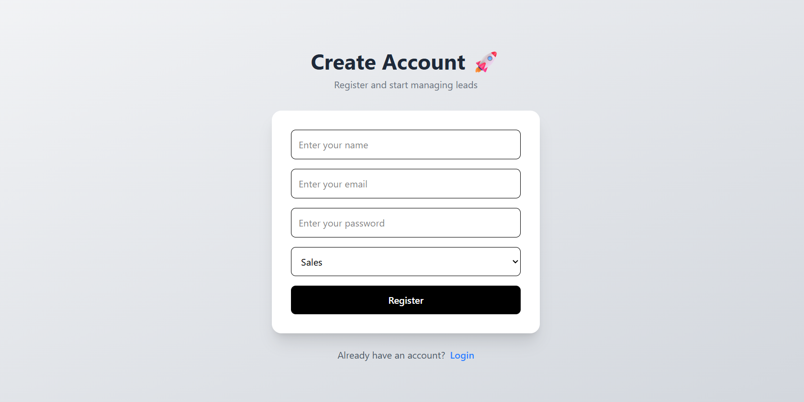
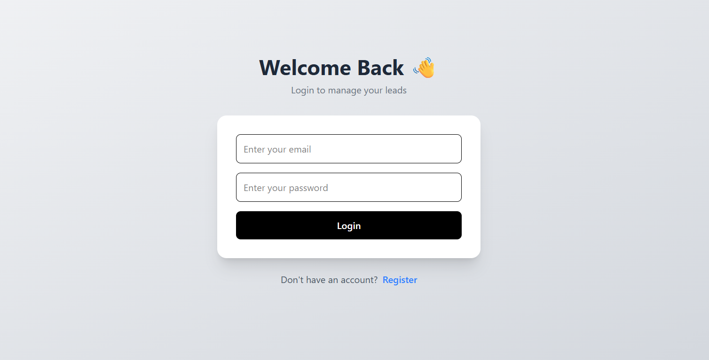
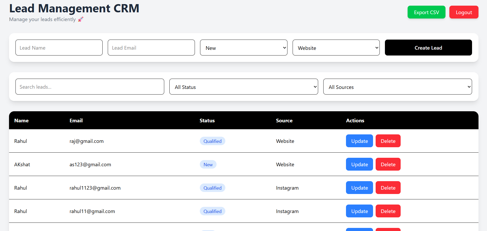

# 🚀 Lead Management CRM

A full-stack Lead Management CRM built using the MERN ecosystem with authentication, role-based access control, pagination, filtering, Docker support, and a modern responsive UI.

Designed to simulate a real-world CRM workflow where teams can manage leads efficiently with secure access control and scalable architecture.

---

# ✨ Features

## 🔐 Authentication & Authorization

* JWT-based Authentication
* Secure Login/Register Flow
* Password Hashing using bcrypt
* Protected Routes
* Role-Based Access Control (RBAC)
* Ownership-based lead access

---

## 📋 Lead Management

* Create Leads
* Update Leads
* Delete Leads
* Fetch Leads
* Search Leads
* Filter by Status
* Filter by Source
* Pagination Support
* CSV Export Support

---

## 🎨 Frontend Features

* Responsive Dashboard UI
* Component-Based Architecture
* Reusable Components
* Clean Service Layer Structure
* Toast Notifications
* Auth Toggle UI
* Modern Tailwind Design

---

## ⚙️ Backend Features

* RESTful APIs
* Global Error Handling
* Async Handler Wrapper
* Zod Validation
* MongoDB Integration
* Ownership Validation
* Structured Service Layer

---

## 🐳 Docker Support

* Dockerized Frontend
* Dockerized Backend
* Docker Compose Support
* Environment-based Configuration

---

# 🛠️ Tech Stack

## Frontend

* React
* TypeScript
* Tailwind CSS
* Axios
* React Router DOM
* React Hot Toast

---

## Backend

* Node.js
* Express.js
* TypeScript
* MongoDB
* Mongoose
* JWT
* bcryptjs
* Zod

---

## DevOps

* Docker
* Docker Compose
* MongoDB Atlas

---

# 📁 Project Structure

```txt
Lead-Management-CRM/
|
├── Backend/
|   ├── src/
|   ├── Dockerfile
|   ├── .dockerignore
|   └── package.json
|
├── Frontend/
|   ├── src/
|   ├── Dockerfile
|   ├── .dockerignore
|   └── package.json
|
├── docker-compose.yml
|
└── README.md
```

---

# 🧠 Architecture Highlights

## Backend Architecture

The backend follows a layered architecture:

```txt
Routes → Controllers → Services → Database
```

This separation improves:

* Scalability
* Maintainability
* Debugging
* Reusability

---

## Frontend Architecture

Frontend is divided into:

```txt
components/
pages/
services/
types/
```

This ensures:

* Clean UI separation
* Reusable logic
* Better scalability
* Easier maintenance

---

# 🔒 Security Features

* Password hashing with bcrypt
* JWT authentication
* Protected API routes
* Ownership-based authorization
* Role-based authorization
* Environment variable protection

---

# 📦 Environment Variables

## Backend `.env`

```env
PORT=5000

MONGO_URI=YOUR_MONGODB_URI

JWT_SECRET=YOUR_SECRET_KEY
```

---

## Frontend `.env`

```env
VITE_API_URL=YOUR_BACKEND_API_URL
```

---

# 🐳 Docker Setup

## Run with Docker

```bash
docker compose up --build
```

---

## Application URLs

### Frontend

```txt
http://localhost:5173
```

### Backend

```txt
http://localhost:5000
```

---

# 💻 Local Development Setup

## 1. Clone Repository

```bash
git clone https://github.com/akshat-jain-01/Lead-Management-System.git
```

---

## 2. Install Backend Dependencies

```bash
cd Backend
npm install
```

---

## 3. Install Frontend Dependencies

```bash
cd Frontend
npm install
```

---

## 4. Configure Environment Variables

Create `.env` files in both:

* Backend/
* Frontend/

---

## 5. Run Backend

```bash
npm run dev
```

---

## 6. Run Frontend

```bash
npm run dev
```

---

# 📸 Screenshots

## Register Page



---

## Login Page



---

## Dashboard



---

# 🚀 Future Improvements

* Dark Mode
* Analytics Dashboard
* Charts & Reports
* Lead Notes System
* Activity Timeline
* Email Integration
* Team Collaboration
* Advanced Search
* Redis Caching
* Microservices Migration

---

# 📚 Learning Outcomes

This project helped in understanding:

* Full-stack application architecture
* Authentication & Authorization
* REST API design
* Dockerization
* Role-based access control
* Scalable frontend structure
* State management patterns
* Service layer architecture
* Real-world CRUD workflows

---

# 👨‍💻 Author

Built with focus on scalable architecture, clean code practices, and real-world backend/frontend workflows.

---

# ⭐ If you found this project useful

Consider giving the repository a star ⭐
